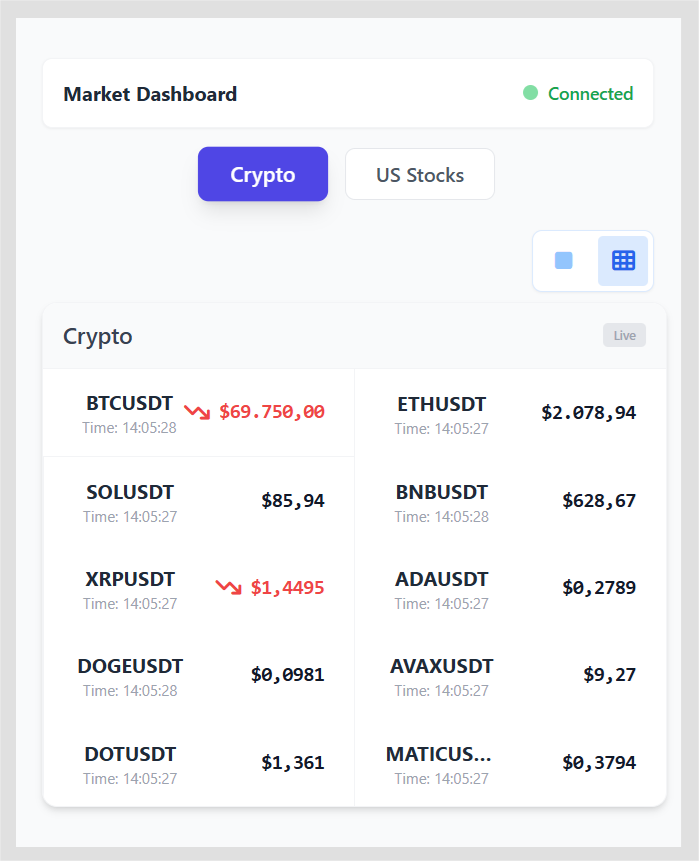
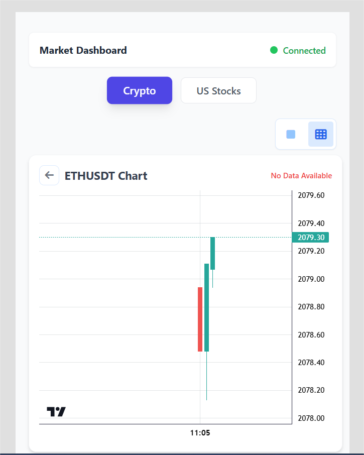

# Real-time Stock Market Dashboard

LIVE DEMO: https://stockmarket-realtime-project.vercel.app/

<p align="center">
  
  
</p>

This project is a React-based application that provides real-time tracking of US Stocks and Cryptocurrency prices. It utilizes the Finnhub API **using both WebSocket and REST API** to fetch initial market data and stream live trade updates, offering an efficient and responsive user experience.

## Features

- **Real-time Data Streaming(WebSocket):** Uses WebSocket integration to receive live trade updates for multiple assets simultaneously without polling.
- **REST API Fallback:** Fetches initial price snapshots via REST API to ensure data availability immediately upon load, even before the first WebSocket message arrives.
- **Hybrid Data Management:** Merges static REST data with dynamic WebSocket updates to maintain a consistent and up-to-date UI.
- **Optimized Performance:**
    - **Separate Hooks:** Decoupled logic with `useFinnhub` (Data Management) and `useFinnhubSocket` (Connection Handling) for better separation of concerns.
    - **Static Symbol Lists:** Uses predefined lists for major US Stocks and Cryptocurrencies to minimize API overhead and latency.
- **Modern UI:** Built with Tailwind CSS for a responsive, clean, and professional dashboard interface.

## Architecture

The application logic is split into two custom hooks:

1.  **`useFinnhubSocket.js`**: Manages the WebSocket connection lifecycle. It handles connecting, subscribing to symbols, converting incoming binary/JSON streams into a structured state, and calculating price directions (Up/Down) by comparing consecutive ticks.
2.  **`useFinnhub.js`**: Acts as the main data controller. It fetches initial data via REST to populate the view instantly and then merges it with the live stream from `useFinnhubSocket`. It formats the data into "Sections" (US Stocks, Crypto) for the UI component.

## Setup and Installation

1.  Clone the repository:
    ```bash
    git clone <repository_url>
    ```

2.  Install dependencies:
    ```bash
    npm install
    ```

3.  Configure Environment Variables:
    Create a `.env` file in the root directory and add your Finnhub API key:
    ```env
    VITE_FINNHUB_API_KEY=your_api_key_here
    ```

4.  Run the development server:
    ```bash
    npm run dev
    ```

## Usage

Once the application is running, it will automatically connect to the Finnhub WebSocket server. You will see a dashboard displaying a curated list of US Stocks and Cryptocurrencies. Prices will flash and update in real-time as trades occur on the exchange.
